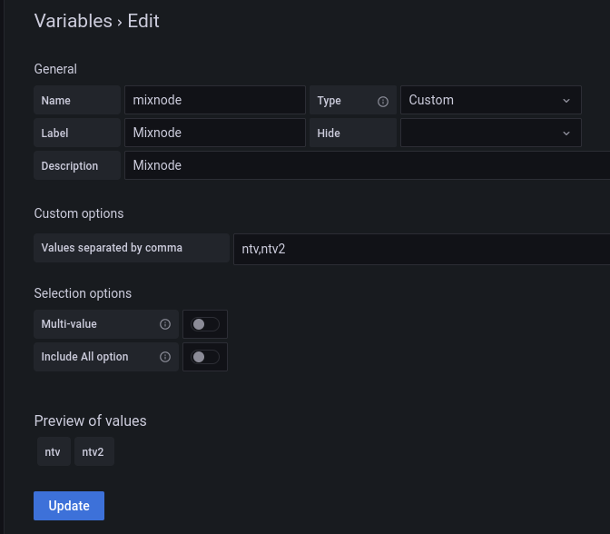
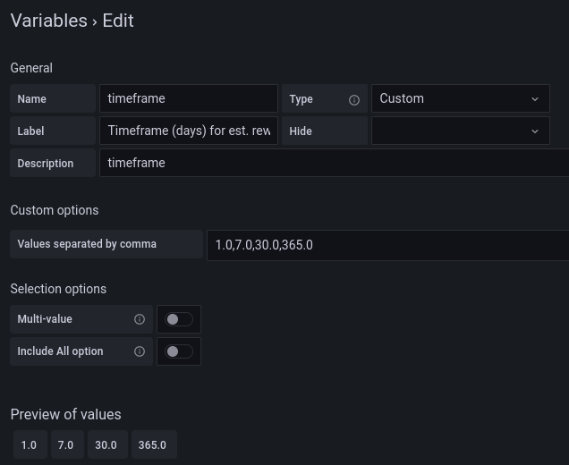

# Status for mixnode

## Pre-requistes
- Telegraf
- InfluxDB v2
- Grafana datasource must be `Flux`

To authenticate from Grafana to InfluxDB a token is mandatory. [https://docs.influxdata.com/influxdb/cloud/security/tokens/create-token/](https://docs.influxdata.com/influxdb/cloud/security/tokens/create-token/)

Grafana dashboard: [grafana.com/grafana/dashboards/16460-ntv-mixnode](https://grafana.com/grafana/dashboards/16460-ntv-mixnode)

Demo: [No Trust Verify mixnode](https://status.notrustverify.ch/)

## Docker install

1. `docker-compose up -d`
2. Configure [influxdb](https://docs.influxdata.com/influxdb/v2.2/install/#set-up-influxdb-through-the-ui)
3. `cp telegraf/telegraf.env.example telegraf/telegraf.env`
4. Set your mixnodes and gateway identity key in `telegraf/telergaf.conf`
5. Create a new variable `mixnode` under `Settings`->`Variables`-> `New`

6. Create a new variable `timeframe` under `Settings`->`Variables`-> `New`

6. docker-compose restart telegraf
